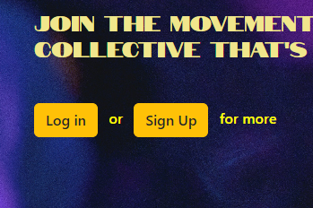
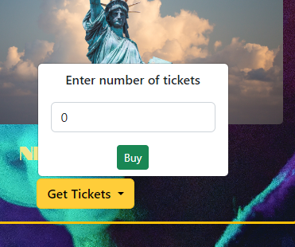

# Hiphop Band Web App

## Contents
1. Description
2. Features
3. Installation
4. Usage
5. Package Requirements
6. Acknowledgement

## Description
This is a web application for a hiphop band with user authentication enabled. Registered users are allowed to view band information like albums, tours, and available merch. Registered users are also allowed to purchase tickets for a tour, buy merch and play album tracks via a youtube link.

## Features
This app allows registered users to:
1. View albums
2. Purchase merch
3. view tours
4. Buy tour tickets
5. Play album tracks

## Installation
The app has not at the time of writing this.

## Usage
Full access is only given to registered users. New users are redirected to a login/sign up page.

Once any user logs in successfully, the user will have access to the group's albums, tours, merch and contact (unregistered users can also see the contacts). Users can purchase tour tickets and a ticket confirmation page will be displayed for the user.

## Package Requirements
* Python 3
* Django 4.1.5

## Acknowledgement
Index page pic by Omran Soliman on Pexels
Album pic by dids on Pexels
Tour pic by Lisa Fotios on Pexels
Merch pic by Vitalinha on Pexels
Reachout pic by Maria Tyutina on Pexels
Tour photos by Pixabay on Pexels